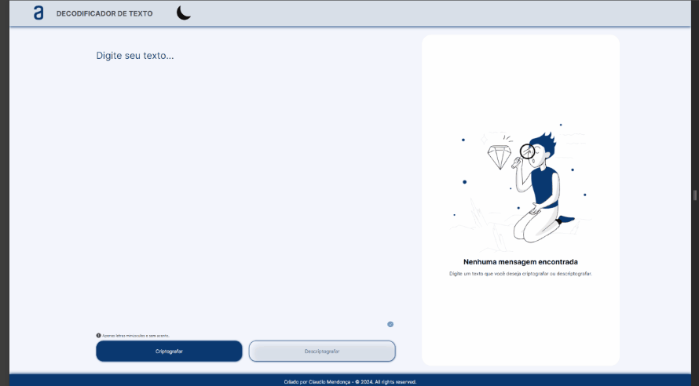

# Alura - ONE Oracle Next Education T6
# Challenge ONE: Lógica de Programação - Decodificador de Texto

Atualmente, tenho o prazer de estar envolvido no programa ONE Oracle Next Education T6, uma iniciativa inovadora resultante da parceria entre a Oracle e a Alura. Estou entusiasmado em compartilhar que estou imerso nessa experiência educacional enriquecedora e dedicada a aprimorar minhas habilidades no mundo da tecnologia.

Neste emocionante percurso educacional, darei meus primeiros no Challenge ONE | Lógica de Programação - Decodificador de Texto. É uma forma de implementar o Challenge Based Learning ou aprendizagem baseada em desafios, mecanismo por meio do qual você vai se engajar na ideia de precisar lidar com um problema proposto.

#oraclenexteducation #alura #HelloONET6 #aluracursos #aluraonline #aluraone #aluraoneoracle #aluraoneoracleeducation #aluraoneoracleeducationt6 #aluraoneoracleeducationt6claudiomendon

Link: 

## Tecnologias

  
  
  

## Índice

- [Instrutores](#instrutor)
- [Apresentação](#apresentacao)
- [Conclusão](#conclusao)
- [Certificado](#certificado)
- [Licença](#licença)

## <a name="instrutor"> Instrutores </a>

[Weslley Bastos](https://github.com/weslleyabastos) - Sou um desenvolvedor front-end apaixonado por tecnologia e inovação. Trabalho ativamente com as tecnologias: JavaScript, React, React Native, TypeScript, Next.js, VueJS, Micro-serviços, GraphQL, Apollo, Gatsby, Redux, GIT, Styled Components, SASS, Rest Api's e Bibliotecas de estilização.

[Genesys Rondón Merchán](https://github.com/genesysR-dev) - Professora em curso de capacitação em TI Formada em Engenharia de Sistemas, Ela caminho a partir de atitude solidária com colegas de turma que estavam com dificuldades de aprendizado.

## <a name="apresentacao"> Apresentação </a>

É com grande entusiasmo que dou as boas-vindas ao nosso primeiro desafio! Nos próximos quinze dias, estaremos imersos no desenvolvimento de uma aplicação incrível que permitirá a troca de mensagens secretas. Estamos prestes a criar algo único: um sistema de criptografia simples, mas eficaz.

Nossa missão é implementar as "chaves" de criptografia, transformando as letras de uma forma única. Para dar um exemplo, a letra "e" será convertida para "enter", "i" para "imes", "a" para "ai", "o" para "ober" e "u" para "ufat". Simples, mas eficiente.

Lembrem-se dos requisitos essenciais: funcionaremos apenas com letras minúsculas, sem acentos ou caracteres especiais. Além disso, nossa aplicação deve permitir a conversão bidirecional, ou seja, criptografar e descriptografar palavras.

No front-end da aplicação, teremos campos para inserção do texto, e a escolha entre criptografar ou descriptografar estará nas mãos da pessoa usuária. O resultado será exibido instantaneamente.

Vamos além com os extras! Implementaremos um botão que copiará o texto para a área de transferência, facilitando a troca de mensagens criptografadas.

Vamos embarcar nessa jornada de quatro semanas juntos. Bom projeto para todos!
